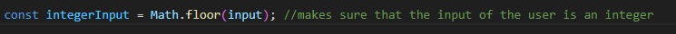
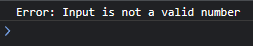
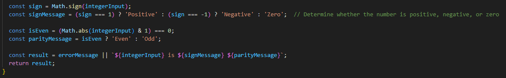
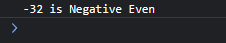

This serves as a practice activity for the usage of math.floor, math.abs and math.sign.

Math.floor is used to check whether the input of the user is an integer and is used to output a message that tells the user to re-enter an input if the input is not an integer.

Math.abs is used to detect whether the input is an odd or even integer and is used alongside math.sign to detect if the output is going to be an positive, negative or zero output.

